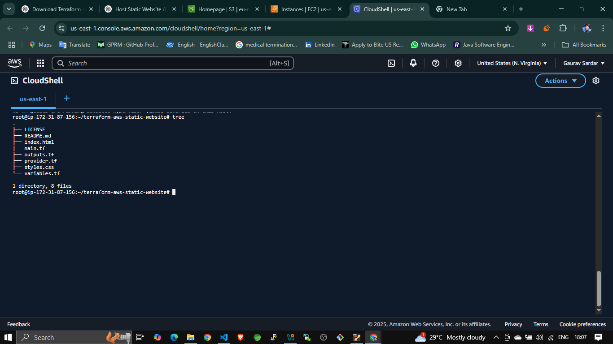
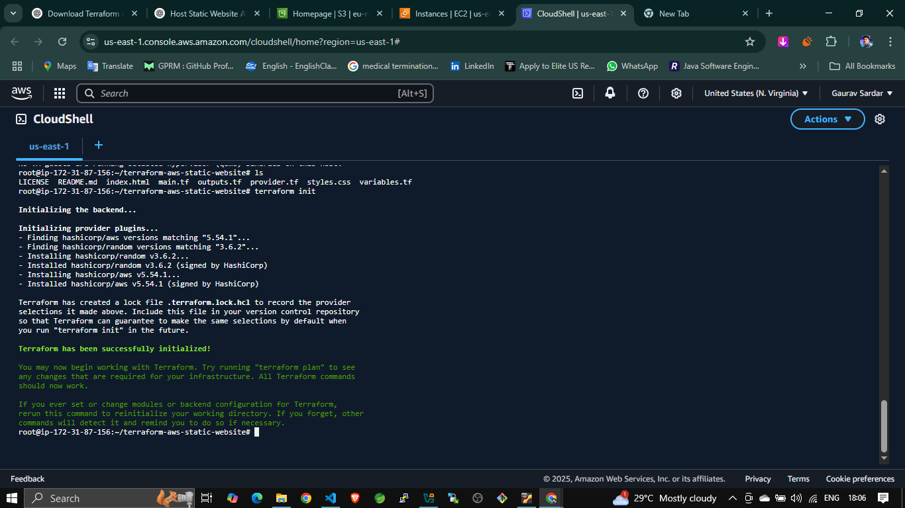
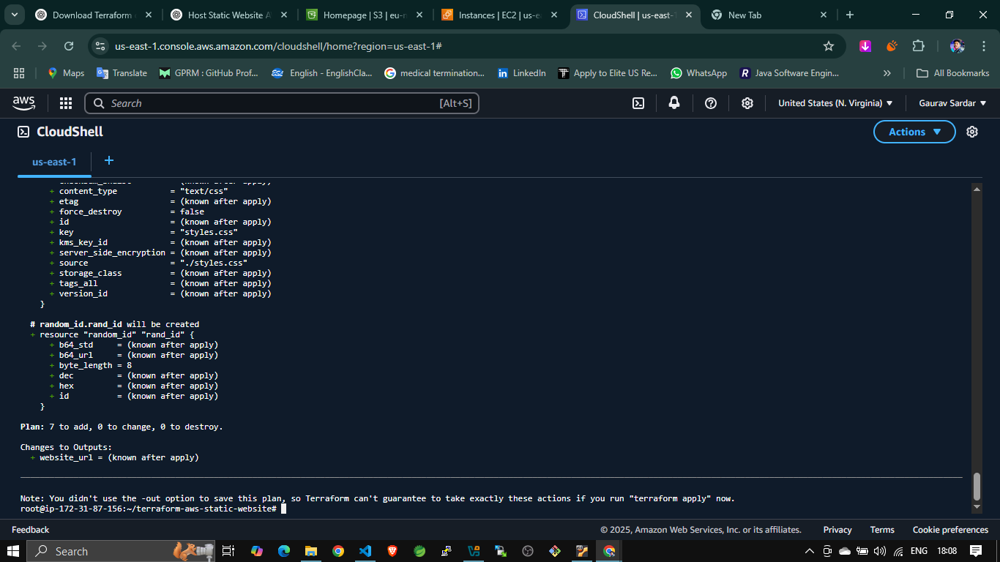
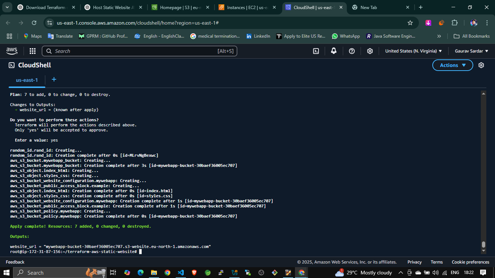
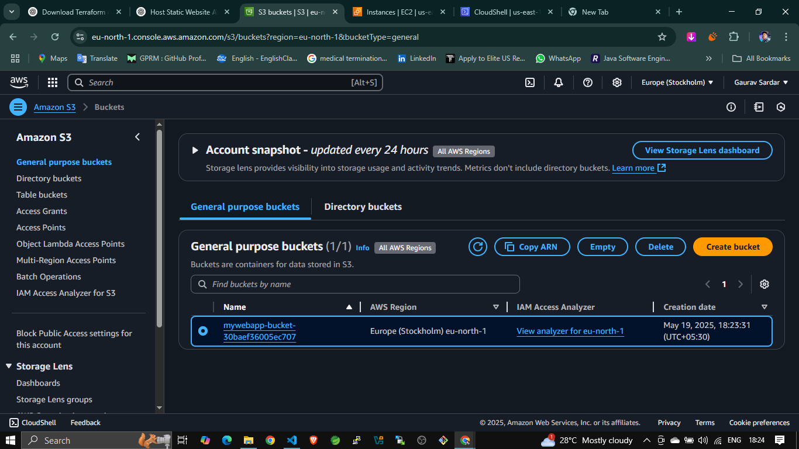
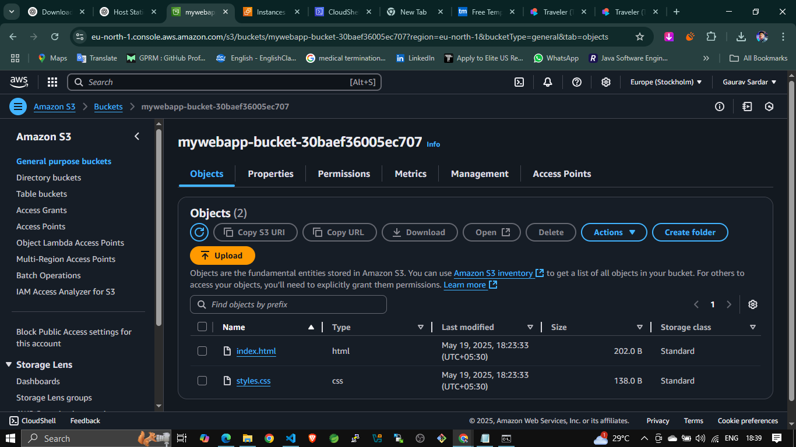
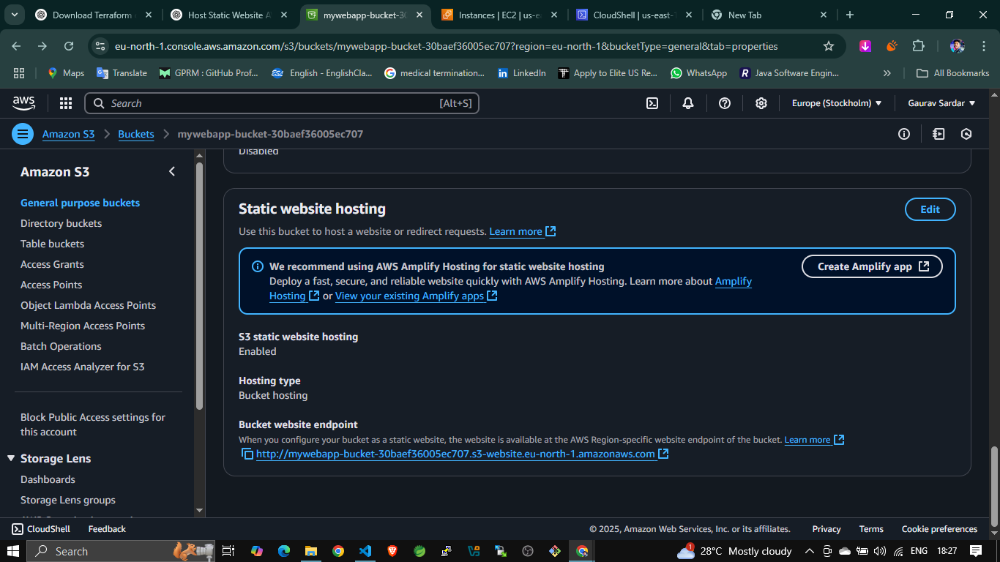
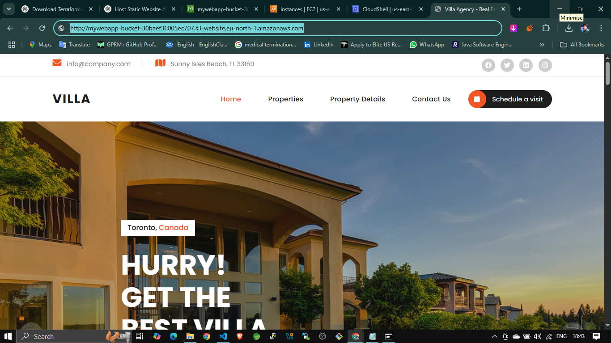

<!-- Great! Now that I have your Terraform code and list of screenshots, I’ll create a professional and informative `README.md` file for your GitHub project.

This README will include:

* 🔹 Project overview
* 🔹 Tech stack
* 🔹 Folder structure
* 🔹 Code snippets with file explanations
* 🔹 Screenshots with small captions
* 🔹 How to use the project
* 🔹 Learnings and contact info

Here's the **complete `README.md`**:

---

```markdown
# 🌐 Static Website Hosting on AWS S3 using Terraform

A fully automated infrastructure setup for hosting a static website on Amazon S3 using Terraform. This project demonstrates how to create an S3 bucket, upload files, configure public access, and enable static website hosting—all through Infrastructure as Code (IaC).

---

## 🚀 Project Objective

To automate the provisioning of AWS resources and host a static HTML/CSS website using Terraform.

---

## 🧰 Tech Stack

- Terraform
- AWS S3
- HTML/CSS
- Random provider
- AWS CLI (optional)

---

## 📁 Project Structure

```

.
├── main.tf                 # S3 bucket, objects, policy & website config
├── provider.tf             # Terraform and AWS provider configuration
├── output.tf               # Outputs the website URL
├── index.html              # Static HTML file
├── styles.css              # Styling for the website

````


---

## 📝 Terraform Code Overview

### 🔧 `provider.tf`

Configures AWS and required providers.

```hcl
terraform {
  required_providers {
    aws = {
      source  = "hashicorp/aws"
      version = "5.54.1"
    }
    random = {
      source  = "hashicorp/random"
      version = "3.6.2"
    }
  }
}

provider "aws" {
  region = "eu-north-1"
}
````

---

### 🏗️ `main.tf`

Creates a unique-named S3 bucket and configures it for website hosting.

```hcl
resource "random_id" "rand_id" {
  byte_length = 8
}
...
resource "aws_s3_object" "index_html" {
  bucket       = aws_s3_bucket.mywebapp_bucket.bucket
  source       = "./index.html"
  key          = "index.html"
  content_type = "text/html"
}
```

---

### 📤 `output.tf`

Displays the final website URL after provisioning.

```hcl
output "website_url" {
  description = "S3 Static Website Endpoint"
  value       = aws_s3_bucket_website_configuration.mywebapp.website_endpoint
}
```

---

## ⚙️ Terraform Execution Workflow

Follow the commands below:

```bash
terraform init
terraform plan
terraform apply
```

### Screenshot: Terraform Initialization

Initializes the working directory and downloads required providers.


---

### Screenshot: Terraform Plan

Shows execution plan before applying changes.


---

### Screenshot: Terraform Apply

Provisions the infrastructure and uploads files.


---

## 📸 AWS Console Outputs

### ✅ S3 Bucket Verification

S3 bucket successfully created via Terraform.


---

### 📁 Uploaded Files

HTML and CSS files uploaded to the S3 bucket.


---

### 🌍 Static Website Settings

Shows website hosting settings with index and error pages configured.


---

### 🌐 Live Website Preview

A working static website hosted on S3 via the public URL.


---

## 🎯 Key Learnings

* Writing reusable Terraform code
* Hosting static websites on AWS S3
* Implementing IAM policies for public access
* Automating end-to-end cloud deployments

---

## 🙋‍♂️ About Me

**Gaurav Sardar** – DevOps Enthusiast | AWS | Terraform | Linux
📩 [gauravsardar85@gmail.com](mailto:gauravsardar85@gmail.com)
🔗 [LinkedIn](https://www.linkedin.com/in/gaurav-sardar)

---

## 🏷️ Tags

`#Terraform` `#AWS` `#S3` `#DevOps` `#CloudComputing` `#IaC` `#StaticWebsite` `#OpenToWork`
 -->


Perfect! Here’s the enhanced **final README.md** with clickable links, badges, and a little more polish for professional presentation:

---

````markdown
# Hosting Static Website on AWS S3 using Terraform  
*By Gaurav Sardar*

---


---

## 🚀 Project Overview

This project automates the hosting of a static website on AWS S3 using Terraform. It demonstrates how Infrastructure as Code (IaC) helps deploy and manage cloud infrastructure efficiently, enabling version control, repeatability, and automation.

---

## 🧱 Tech Stack

- Terraform  
- AWS S3  
- HTML/CSS  
- Linux Terminal  
- AWS CLI  

---

## 📁 Project Folder Structure

Below is the structure of the project files including Terraform scripts and website files.

  
*Project organized with Terraform config files and website assets.*

---

## ⚙️ Terraform Code Snippets

### provider.tf

```hcl
terraform {
  required_providers {
    aws = {
      source  = "hashicorp/aws"
      version = "5.54.1"
    }
    random = {
      source  = "hashicorp/random"
      version = "3.6.2"
    }
  }
}

provider "aws" {
  region = "eu-north-1"
}
````

*Configures AWS provider and region for Terraform.*

---

### main.tf

```hcl
resource "random_id" "rand_id" {
  byte_length = 8
}

resource "aws_s3_bucket" "mywebapp_bucket" {
  bucket = "mywebapp-bucket-${random_id.rand_id.hex}"
}

resource "aws_s3_bucket_public_access_block" "example" {
  bucket = aws_s3_bucket.mywebapp_bucket.id

  block_public_acls       = false
  block_public_policy     = false
  ignore_public_acls      = false
  restrict_public_buckets = false
}

resource "aws_s3_bucket_policy" "mywebapp" {
  bucket = aws_s3_bucket.mywebapp_bucket.id

  depends_on = [aws_s3_bucket_public_access_block.example]

  policy = jsonencode(
    {
      Version = "2012-10-17",
      Statement = [
        {
          Sid       = "PublicReadGetObject",
          Effect    = "Allow",
          Principal = "*",
          Action    = "s3:GetObject",
          Resource  = "${aws_s3_bucket.mywebapp_bucket.arn}/*"
        }
      ]
    }
  )
}

resource "aws_s3_bucket_website_configuration" "mywebapp" {
  bucket = aws_s3_bucket.mywebapp_bucket.id

  index_document {
    suffix = "index.html"
  }
}

resource "aws_s3_object" "index_html" {
  bucket       = aws_s3_bucket.mywebapp_bucket.bucket
  source       = "./index.html"
  key          = "index.html"
  content_type = "text/html"
}

resource "aws_s3_object" "styles_css" {
  bucket       = aws_s3_bucket.mywebapp_bucket.bucket
  source       = "./styles.css"
  key          = "styles.css"
  content_type = "text/css"
}
```

*Creates a random bucket name, sets public access, bucket policy, website config, and uploads HTML/CSS files.*

---

### output.tf

```hcl
output "website_url" {
  description = "S3 Static Website Endpoint"
  value       = aws_s3_bucket_website_configuration.mywebapp.website_endpoint
}
```

*Outputs the static website URL after deployment.*

---

## ⚡ Terraform Deployment Workflow

### Terraform Init


*Initializes Terraform configuration and downloads necessary AWS providers.*

---

### Terraform Plan


*Shows the planned AWS resources Terraform will create or change.*

---

### Terraform Apply


*Applies the plan, creating S3 bucket, policies, and uploading website files.*

---

## ☁️ AWS Console Verification

### S3 Bucket Created


*Verifies the S3 bucket exists in the AWS Console.*

---

### Uploaded Website Files


*Confirms the HTML and CSS files are uploaded to the S3 bucket.*

---

### Static Website Hosting Enabled


*Shows static website hosting configuration with index document.*

---

### Final Website Preview


*Live preview of the hosted static website from S3.*

---

## 🎓 What I Learned

* Automating AWS infrastructure using Terraform
* Writing public read bucket policies for static websites
* Structuring Terraform code for reusability and clarity
* Managing website deployment with Infrastructure as Code

---

## 📩 Connect with Me

* [LinkedIn](https://www.linkedin.com/in/gaurav-sardar)
* Email: [gauravsardar85@gmail.com](mailto:gauravsardar85@gmail.com)
* Phone: +91 7499004477

---

## 📢 Hashtags

\#terraform #aws #devops #cloudcomputing #iac #s3 #staticwebsite #cloudengineer #openforwork #GauravSardar
